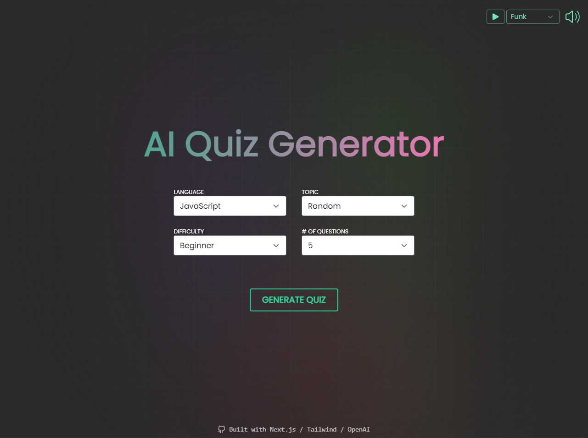

# AI Quiz Generator

An AI-powered quiz app that generates challenging, thought-provoking multiple choice questions on any topic. Built with Next.js and powered by multiple AI providers (Groq, Google Gemini, OpenAI) with automatic fallback.

[View Live App](https://ai-quiz-generator-next.vercel.app/)



## Features

- **AI-Generated Questions** — Uses advanced prompt engineering to create questions that test real understanding, not just surface-level recall
- **Multi-Provider AI** — Tries Groq (free) → Google Gemini → OpenAI, with automatic fallback if a provider is unavailable
- **Customizable Quizzes** — Choose any topic, difficulty level (easy/medium/hard), and number of questions
- **Smart Distractors** — Wrong answers are designed to target common misconceptions, making quizzes genuinely challenging
- **Difficulty-Aware** — Easy tests core concepts, Medium requires nuance, Hard covers edge cases and advanced scenarios
- **Loading Screen** — Displays random programming facts while the AI generates your quiz
- **Ed-Style Quiz UI** — Multiple choice questions with explanations and a progress bar
- **Score-Based End Screen** — Adaptive gifs, sarcastic messages, and confetti (>= 80%) based on your score
- **Audio Player** — 14-track kahoot-flavored music player

## Tech Stack

- **Framework:** Next.js 13.4 (App Router)
- **Styling:** Tailwind CSS
- **AI Providers:** Groq (Llama 3.3 70B) · Google Gemini 2.0 Flash · OpenAI GPT-4o Mini
- **Deployment:** Vercel

## Getting Started

### 1. Clone the repo

```bash
git clone https://github.com/lucky-008/AI-quiz-generator.git
cd AI-quiz-generator
```

### 2. Install dependencies

```bash
npm install
```

### 3. Set up environment variables

Create a `.env.local` file in the root directory:

```env
GROQ_API_KEY=your_groq_api_key
GOOGLE_API_KEY=your_google_api_key
OPENAI_API_KEY=your_openai_api_key
```

You need **at least one** API key. Recommended: **Groq** (free, no credit card required).

| Provider | Get Key | Free Tier |
|----------|---------|-----------|
| Groq | [console.groq.com/keys](https://console.groq.com/keys) | Yes, generous |
| Google Gemini | [aistudio.google.com/app/apikey](https://aistudio.google.com/app/apikey) | Yes |
| OpenAI | [platform.openai.com/api-keys](https://platform.openai.com/api-keys) | Paid only |

### 4. Run the dev server

```bash
npm run dev
```

Open [http://localhost:3000](http://localhost:3000) in your browser.

## How It Works

1. User selects a topic, difficulty, and number of questions
2. A detailed prompt is built with instructions for question quality, distractor design, and difficulty calibration
3. The app tries AI providers in order: **Groq → Google Gemini → OpenAI**
4. The AI response is parsed, validated, and normalized into a consistent quiz format
5. If all providers fail, a hardcoded fallback quiz is served

## Packages Used

- [framer-motion](https://www.framer.com/motion/) — Animations
- [highlight.js](https://www.npmjs.com/package/highlight.js) — Syntax highlighting
- [react-confetti](https://www.npmjs.com/package/react-confetti) — Confetti effect
- [react-loader-spinner](https://www.npmjs.com/package/react-loader-spinner) — Loading spinners
- [react-icons](https://react-icons.github.io/react-icons/) — Icons
- [react-use](https://github.com/streamich/react-use) — `useAudio()` hook
- [react-simple-typewriter](https://www.npmjs.com/package/react-simple-typewriter) — Typewriter effect

## Screenshots


