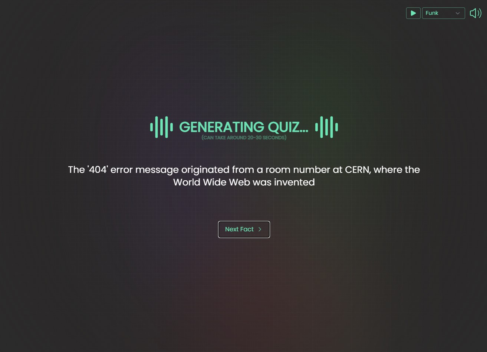
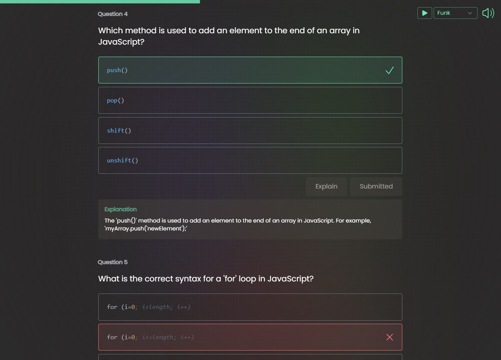
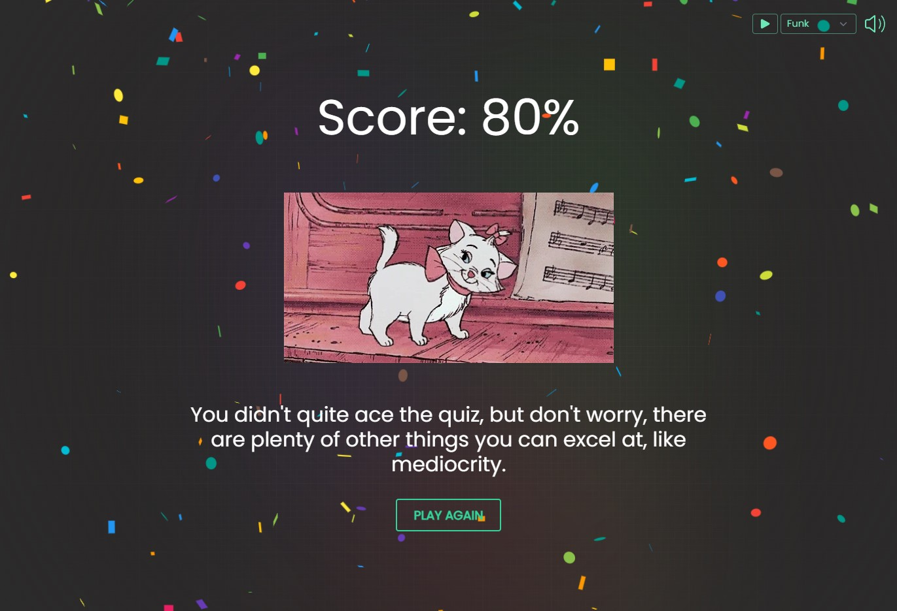

# AI Quiz Generator

An AI-powered quiz app that generates challenging multiple choice questions on **any topic**. Powered by multiple AI providers with automatic fallback, wrapped in a fun UI with music, confetti, and sarcastic end-screen messages.


## Features

**Quiz Generation**
- Enter any topic (or leave blank for a random one), pick a difficulty (Easy / Moderate / Hard), and choose 1–100 questions
- AI generates thought-provoking questions with plausible distractors that target common misconceptions
- Difficulty-aware prompting: Easy tests core concepts, Moderate requires nuance, Hard covers edge cases

**Multi-Provider AI**
- Tries providers in order: **Groq** (Llama 3.3 70B) → **Google Gemini** 2.0 Flash → **OpenAI** GPT-4o Mini
- Automatic fallback — if one provider is down or over quota, the next one kicks in
- If all providers fail, serves a hardcoded fallback quiz so the app never breaks

**Quiz UI**
- Multiple choice cards with submit, correct/incorrect feedback (green check / red X), and expandable explanations
- Animated progress bar (Framer Motion spring animation) tracks how many questions you've answered
- Syntax highlighting (highlight.js) for code-based questions

**Loading Screen**
- Animated spinner with pulsing "Generating Quiz..." text
- Random programming facts and jokes displayed with a typewriter effect
- Raw AI response stream shown as a decorative background element

**End Screen**
- Score-based results with 3 tiers: Perfect (100%), Good (≥70%), Bad (<70%)
- Random sarcastic messages — from backhanded compliments to humorous roasts
- Random GIFs from Giphy matching your performance
- Confetti explosion for scores ≥80%

**Audio Player**
- 14 background music tracks: Original, Fantasy, Adventure, Disco, Funk, 80s Vibe, Reggae, Trance, Beatbox, 8-Bit, Futuristic, Indie Pop, Christmas, Halloween
- Play/stop toggle, track selector dropdown, 4-level volume cycling (Off → Quiet → Moderate → Loud)
- Persists across all pages

## Tech Stack

| Category | Technology |
|----------|------------|
| Framework | Next.js 13.4 (App Router) |
| Styling | Tailwind CSS |
| AI Providers | Groq · Google Gemini · OpenAI |
| Animations | Framer Motion |
| Font | Poppins (Google Fonts) |


## Getting Started

### 1. Clone & install

```bash
git clone https://github.com/lucky-008/AI-quiz-generator.git
cd AI-quiz-generator
npm install
```

### 2. Set up API keys

Create a `.env.local` file in the root:

```env
GROQ_API_KEY=your_groq_key
GOOGLE_API_KEY=your_google_key
OPENAI_API_KEY=your_openai_key
```

You only need **one** key. Groq is recommended — it's free with no credit card required.

| Provider | Get a Key | Free? |
|----------|-----------|-------|
| **Groq** | [console.groq.com/keys](https://console.groq.com/keys) | Yes — generous free tier |
| Google Gemini | [aistudio.google.com/app/apikey](https://aistudio.google.com/app/apikey) | Yes |
| OpenAI | [platform.openai.com/api-keys](https://platform.openai.com/api-keys) | Paid only |

### 3. Run

```bash
npm run dev
```

Open [http://localhost:3000](http://localhost:3000).

## How It Works

```
User picks topic/difficulty/count
        ↓
POST /api/chat with settings
        ↓
Try Groq → Try Gemini → Try OpenAI → Fallback
        ↓
AI response parsed, validated, normalized
        ↓
Quiz rendered → User answers → Score calculated
        ↓
End screen with GIF + message + confetti
```

## Project Structure

```
app/
├── page.jsx                  # Home — topic/difficulty form
├── quiz/page.jsx             # Quiz — questions, scoring, progress
├── end-screen/page.jsx       # Results — score, GIF, message
├── api/chat/route.js         # AI quiz generation endpoint
├── components/
│   ├── AudioPlayer.jsx       # 14-track music player
│   ├── Question.jsx          # MCQ card with feedback
│   ├── LoadingScreen.jsx     # Animated loader with facts
│   ├── Facts.jsx             # Typewriter fact display
│   └── Speak.jsx             # Speech synthesis (unused)
├── constants/
│   ├── topics.js             # Pre-defined topic lists
│   ├── facts.js              # 38 tech facts + 13 jokes
│   ├── gifs.js               # Score-based GIF collections
│   ├── endMessages.js        # Sarcastic result messages
│   └── testQuiz.js           # Dev/test quiz data
└── utils/
    ├── index.js              # Utility helpers
    └── OpenAIStream.js       # SSE streaming (legacy)
```

## Key Packages

- [framer-motion](https://www.framer.com/motion/) — Progress bar animation
- [highlight.js](https://highlightjs.org/) — Code syntax highlighting
- [react-confetti](https://www.npmjs.com/package/react-confetti) — Confetti effect
- [react-simple-typewriter](https://www.npmjs.com/package/react-simple-typewriter) — Typewriter text
- [react-loader-spinner](https://www.npmjs.com/package/react-loader-spinner) — Loading animation
- [react-icons](https://react-icons.github.io/react-icons/) — UI icons
- [react-use](https://github.com/streamich/react-use) — Audio hook

## Screenshots






